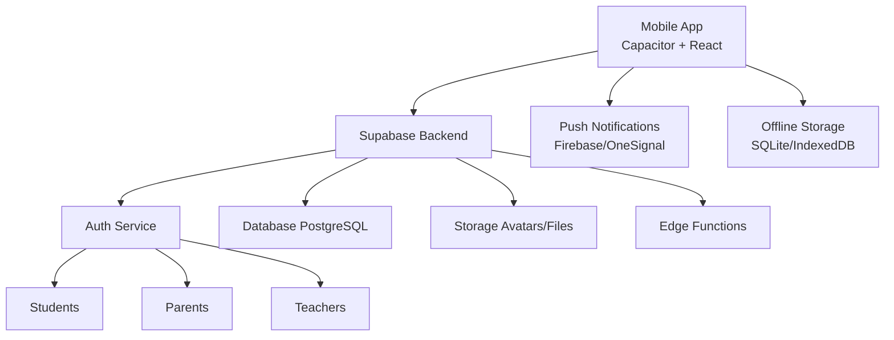

# План мобильного приложения «Электронный дневник»

Разработка кроссплатформенного мобильного приложения для системы электронного дневника с поддержкой Android (APK) и iOS.

## Цель проекта

Создать удобное мобильное приложение для всех участников образовательного процесса:
- **Ученики**: просмотр оценок, расписания, домашних заданий
- **Родители**: контроль успеваемости детей, связь с учителями
- **Учителя**: управление записями дневника, выставление оценок, общение с родителями

---

## Выбор технологии

### Рекомендуемый стек: **Capacitor + React**

**Преимущества:**
- Переиспользование существующего React-кода веб-приложения
- Единая кодовая база для Web/Android/iOS
- Нативный доступ к камере, уведомлениям, файловой системе
- Быстрая разработка и обновления через OTA (Over-The-Air)

**Альтернатива:** React Native (если нужна максимальная производительность)

---

## Архитектура приложения



---

## Основные функции по ролям

### 👨‍🎓 Для учеников

#### Главный экран (Dashboard)
- Сегодняшнее расписание уроков
- Непрочитанные уведомления (новые оценки, ДЗ)
- Быстрый доступ к актуальным домашним заданиям

#### Дневник
- Просмотр оценок по предметам (таблица/график)
- Записи учителей о поведении и успеваемости
- Фильтрация по дате/предмету

#### Домашние задания
- Список заданий с дедлайнами
- Отметка «Выполнено»
- Прикрепление файлов (фото решения, документы)
- Push-уведомления за день до сдачи

#### Расписание
- Недельное расписание с кабинетами
- Замены уроков (выделены цветом)
- Синхронизация с календарем телефона

#### Профиль
- Редактирование аватара и личных данных
- Настройки уведомлений
- Выход из аккаунта

---

### 👨‍👩‍👧 Для родителей

#### Главный экран
- Выбор ребенка (если детей несколько)
- Сводка успеваемости за неделю
- Последние записи учителей

#### Дневник ребенка
- Полный доступ к оценкам и записям
- Комментарии учителей
- Возможность оставить обратную связь

#### Домашние задания
- Контроль выполнения ДЗ
- Уведомления о просроченных заданиях

#### Связь с учителями
- Чат с классным руководителем
- Запись на родительское собрание
- История переписки

#### Уведомления
- Новые оценки (особенно низкие)
- Замечания по поведению
- Пропуски уроков

---

### 👨‍🏫 Для учителей

#### Главный экран
- Расписание на день
- Список классов
- Быстрый доступ к журналу

#### Журнал успеваемости
- Выставление оценок
- Массовое редактирование (вся колонка)
- Статистика по классу

#### Создание записей дневника
- Шаблоны записей (похвала, замечание, рекомендация)
- Прикрепление фото/файлов
- Настройка видимости (только родители/все)

#### Домашние задания
- Создание ДЗ с описанием и дедлайном
- Прикрепление материалов
- Отслеживание выполнения

#### Связь с родителями
- Ответы на сообщения
- Массовые уведомления классу

---

## UI/UX дизайн

### Принципы дизайна
1. **Минимализм**: Крупные кнопки, четкая иерархия
2. **Адаптивность**: Поддержка темной темы
3. **Быстрый доступ**: Главные действия на расстоянии одного тапа
4. **Визуальная обратная связь**: Анимации загрузки, успешные действия

### Цветовая схема
- **Основной**: Синий (#3B82F6) — доверие, образование
- **Успех**: Зеленый (#10B981) — хорошие оценки
- **Внимание**: Желтый (#F59E0B) — дедлайны
- **Ошибка**: Красный (#EF4444) — плохие оценки, замечания

### Ключевые экраны
1. **Splash Screen**: Логотип школы + индикатор загрузки
2. **Авторизация**: Email/пароль + «Забыли пароль?»
3. **Онбординг**: 3 слайда с объяснением функций (только при первом запуске)
4. **Главный экран**: Карточки с основной информацией
5. **Боковое меню**: Навигация по разделам + профиль

---

## Технический план реализации

### Этап 1: Подготовка (1-2 недели)
- [ ] Установка Capacitor в существующий React-проект
- [ ] Настройка Android Studio и Xcode
- [ ] Создание иконок и splash screens
- [ ] Настройка Firebase для push-уведомлений

### Этап 2: Адаптация UI (2-3 недели)
- [ ] Создание мобильных компонентов (BottomNav, SwipeableCards)
- [ ] Адаптация существующих страниц под мобильные экраны
- [ ] Реализация темной темы
- [ ] Добавление жестов (swipe, pull-to-refresh)

### Этап 3: Нативные функции (1-2 недели)
- [ ] Интеграция камеры для загрузки фото
- [ ] Локальное хранилище (кэш оценок для offline)
- [ ] Push-уведомления
- [ ] Биометрическая аутентификация (Face ID/Touch ID)

### Этап 4: Оптимизация (1 неделя)
- [ ] Минификация и сжатие ресурсов
- [ ] Lazy loading для больших списков
- [ ] Оптимизация запросов к Supabase
- [ ] Тестирование на реальных устройствах

### Этап 5: Публикация (1 неделя)
- [ ] Подготовка описания для Google Play
- [ ] Создание скриншотов и промо-видео
- [ ] Подписание APK ключом
- [ ] Загрузка в Google Play Console
- [ ] (Опционально) Публикация в App Store

---

## Структура проекта

```
slp23/
├── android/                 # Нативный Android проект
├── ios/                     # Нативный iOS проект
├── src/
│   ├── mobile/             # Мобильные компоненты
│   │   ├── components/
│   │   │   ├── BottomNav.tsx
│   │   │   ├── MobileHeader.tsx
│   │   │   └── SwipeCard.tsx
│   │   ├── screens/
│   │   │   ├── student/
│   │   │   │   ├── DashboardScreen.tsx
│   │   │   │   ├── GradesScreen.tsx
│   │   │   │   └── HomeworkScreen.tsx
│   │   │   ├── parent/
│   │   │   └── teacher/
│   │   └── hooks/
│   │       ├── usePushNotifications.ts
│   │       └── useOfflineSync.ts
│   └── shared/             # Общие компоненты для Web+Mobile
├── capacitor.config.ts
└── package.json
```

---

## Push-уведомления

### Триггеры для учеников
- Новая оценка выставлена
- Новое домашнее задание
- Завтра дедлайн ДЗ
- Изменение в расписании

### Триггеры для родителей
- Оценка ниже 3
- Замечание по поведению
- Пропуск урока
- Сообщение от учителя

### Триггеры для учителей
- Новое сообщение от родителя
- Напоминание о незаполненном журнале

---

## Offline-режим

### Что доступно без интернета
- Просмотр ранее загруженных оценок
- Чтение домашних заданий
- Просмотр расписания на неделю

### Синхронизация
- При подключении к сети автоматически загружаются обновления
- Индикатор «Последнее обновление: 5 минут назад»

---

## Безопасность

1. **Аутентификация**: JWT токены с автообновлением
2. **Шифрование**: HTTPS для всех запросов
3. **Локальное хранилище**: Шифрование чувствительных данных
4. **Биометрия**: Опциональная разблокировка по отпечатку/лицу
5. **Автовыход**: После 30 минут неактивности

---

## Метрики успеха

### KPI для запуска
- Установок в первый месяц: 100+
- Средняя оценка в Google Play: 4.5+
- DAU (Daily Active Users): 60% от установок
- Crash-free rate: 99%+

### Аналитика
- Firebase Analytics для отслеживания действий
- Crashlytics для мониторинга ошибок
- Heatmaps для понимания UX

---

## Roadmap после запуска

### Версия 1.1 (через 1 месяц)
- Виджет на главный экран (расписание на сегодня)
- Темная тема
- Поддержка планшетов

### Версия 1.2 (через 3 месяца)
- Чат между учениками класса
- Интеграция с Google Calendar
- Экспорт оценок в PDF

### Версия 2.0 (через 6 месяцев)
- Gamification (достижения за хорошие оценки)
- AI-ассистент для помощи с ДЗ
- Видеозвонки учитель-родитель

---

## Бюджет и ресурсы

### Необходимые инструменты
- **Google Play Console**: $25 (единоразово)
- **Apple Developer Program**: $99/год (если нужен iOS)
- **Firebase**: Бесплатный план (до 10K пользователей)
- **Хостинг**: Уже есть (Supabase)

### Команда
- 1 Frontend разработчик (React/Capacitor)
- 1 UI/UX дизайнер (для мобильных макетов)
- 1 QA тестировщик (ручное тестирование на устройствах)

### Сроки
**Общее время разработки: 6-8 недель**
